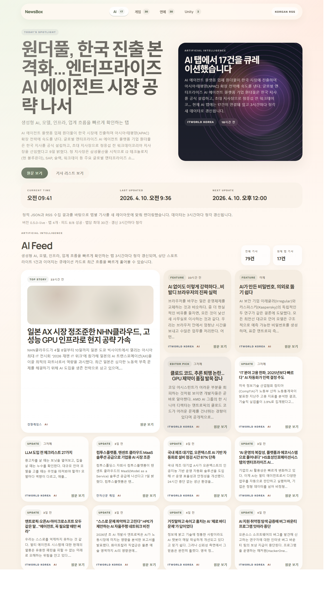

# NewsBox

  5개의 고정 탭으로 한국어 AI, 게임, 연예, e스포츠, Unity 뉴스를 빠르게 훑어보는 정적 큐레이션 프로젝트

  

  <a href="https://arkjsj86.github.io/NewsBox/">https://arkjsj86.github.io/NewsBox/</a>

## Overview

NewsBox는 `AI`, `게임`, `연예`, `e스포츠`, `Unity` 5개 탭을 중심으로 한국어 뉴스를 한곳에서 빠르게 확인할 수 있게 만든 프로젝트다.

이 프로젝트는 브라우저에서 직접 여러 매체를 뒤지는 대신, RSS 피드를 모아 기사 후보를 추린 뒤 탭별 정적 JSON으로 만들어 보여준다. 덕분에 배포는 가볍고, 분류 기준은 코드로 명확하게 관리할 수 있다.

## Why NewsBox

- 주제별 탭으로 관심 있는 흐름을 빠르게 스캔할 수 있다.
- 같은 내용의 기사가 반복 노출되는 문제를 줄이도록 중복 제거를 적용했다.
- GitHub Pages 기반 정적 사이트라 배포와 유지가 단순하다.
- RSS 수집기와 분류 규칙이 분리되어 있어 테스트 프로젝트로 다듬기 좋다.

## Current Scope

- 한국어 기사 기반 5개 주제 탭 제공
- 탭별 기사 카드 렌더링
- 한국어 RSS 피드 기반 JSON 생성
- GitHub Pages 배포
- GitHub Actions 기반 주기 갱신

## 현재 변경 상태

- 탭 구조를 `AI / 게임 / 연예 / e스포츠 / Unity` 5개로 확장했다.
- 예전에 분리되어 있던 `게임 산업 / 게임 개발 / 게임 일반` 생성 파일은 제거하고 `게임` 단일 탭으로 정리했다.
- 연예 RSS 3종을 연결해 `연예` 탭을 실제 데이터로 채우도록 구성했다.
- 연예 기사 분류는 `영화 / 드라마 / 배우 / 가수 / 예능 / OTT` 같은 핵심 신호를 우선 보고, 코인·증시·보안성 잡음 기사는 제외하도록 보강했다.
- e스포츠 탭은 RSS 기사와 공식 `LoL Esports` 일정 데이터를 함께 사용하고, 스포트라이트는 `LCK -> MSI -> Worlds` 우선순위로 자동 전환되도록 구성했다.
- 메타데이터와 생성 JSON도 5탭 기준으로 다시 맞춰서 GitHub Pages에서 그대로 확인할 수 있는 상태로 정리했다.

## Tabs

- `AI`: 생성형 AI, 모델, 인프라, 에이전트, 업계 흐름
- `게임`: 출시, 업데이트, 개발, 산업 이슈를 통합한 게임 뉴스
- `연예`: 배우, 아이돌, 드라마, 영화, 방송, OTT 화제
- `e스포츠`: LCK, MSI, Worlds 일정과 e스포츠 기사
- `Unity`: Unity 엔진, 생태계, 정책, 툴 업데이트

## Project Notes

- 현재 사이트는 `data` 폴더의 정적 JSON 파일을 읽어 동작한다.
- 실제 기사 수집은 `scripts/update-rss-news.mjs`가 담당한다.
- 수집 스크립트는 최근성, 한국어 여부, 관련성, 중복 제거, 탭 분류를 거쳐 `data` JSON을 갱신한다.
- e스포츠 스포트라이트는 `data/spotlights/esports.json`으로 따로 생성되며, 공식 LoL Esports 일정 페이지를 읽어온다.
- 화면은 동적 UI처럼 탭 전환을 하지만, 기사 데이터 자체는 사전 생성된 정적 데이터다.

## Data Sources

현재 기본 피드는 아래 조합을 사용한다.

- ITWorld Korea
- 전자신문 게임
- 게임인사이트
- 게임인사이트 AI/블록체인
- 경향게임스
- 스포츠조선 연예
- 뉴시스 연예
- 스포츠동아 엔터테인먼트
- LoL Esports 공식 일정 페이지

## Run Locally

1. 프로젝트 루트에서 `node scripts/serve.mjs`
2. 브라우저에서 `http://127.0.0.1:4173` 접속
3. 탭 전환과 기사 카드 렌더링 확인

실제 뉴스 데이터 갱신을 로컬에서 테스트하려면 `node scripts/update-rss-news.mjs`를 실행하면 된다.

## News Automation

- 스케줄 워크플로: [.github/workflows/update-news.yml](./.github/workflows/update-news.yml)
- 수집 스크립트: [scripts/update-rss-news.mjs](./scripts/update-rss-news.mjs)
- GitHub Actions 주기: `3시간마다 정각`

워크플로는 주기적으로 RSS 피드를 다시 읽고 `data` 폴더가 바뀌면 자동 커밋한다. 이후 Pages 배포가 다시 실행되어 사이트가 갱신된다.

## Deployment

- Live site: [https://arkjsj86.github.io/NewsBox/](https://arkjsj86.github.io/NewsBox/)
- Workflow: [.github/workflows/deploy-pages.yml](./.github/workflows/deploy-pages.yml)
- Build script: [scripts/build-pages.mjs](./scripts/build-pages.mjs)

## Docs

- 탭 분류 기준: [docs/tab-classification.md](./docs/tab-classification.md)
- 초기 구조 제안: [docs/initial-structure.md](./docs/initial-structure.md)
- 연예 분류 점검 메모: [docs/entertainment-classification-audit.md](./docs/entertainment-classification-audit.md)
- e스포츠 탭 설계안: [docs/esports-tab-plan.md](./docs/esports-tab-plan.md)

## One Line

NewsBox는 한국어 AI, 게임, 연예, e스포츠, Unity 뉴스를 탭별로 모아 중복을 줄이고 정적 JSON으로 배포하는 뉴스 큐레이션 프로젝트다.
